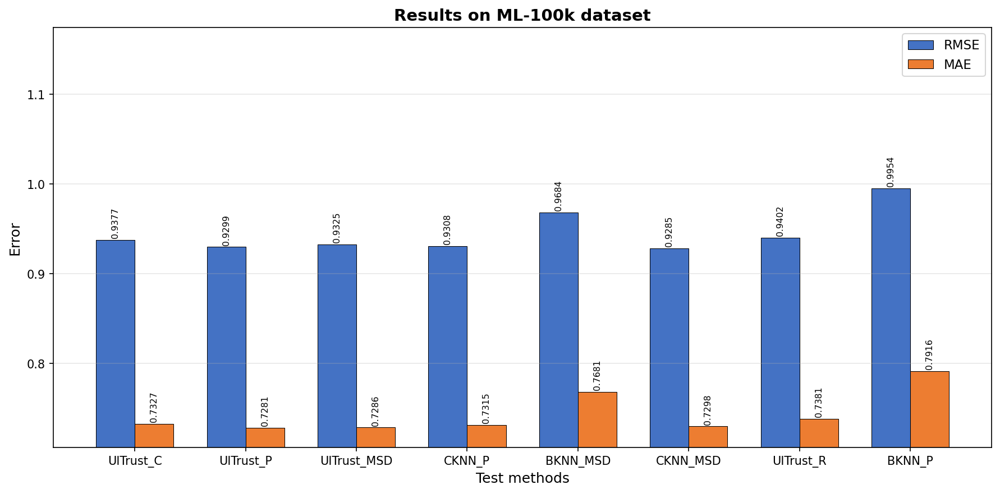
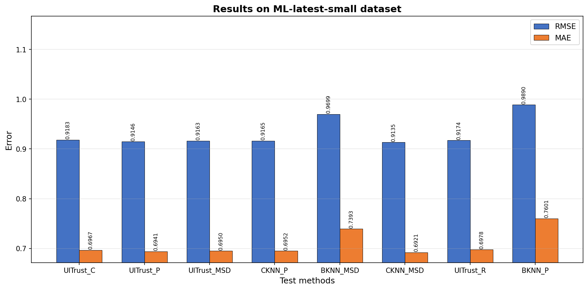
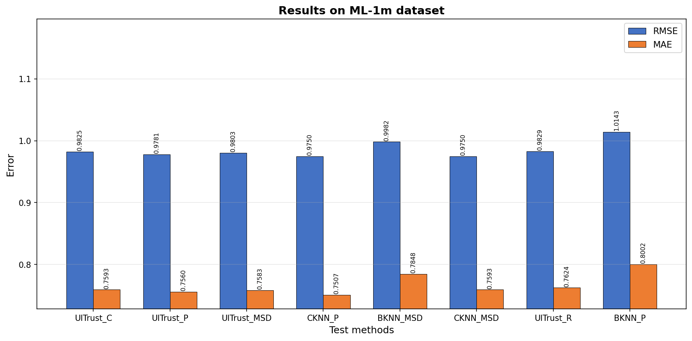
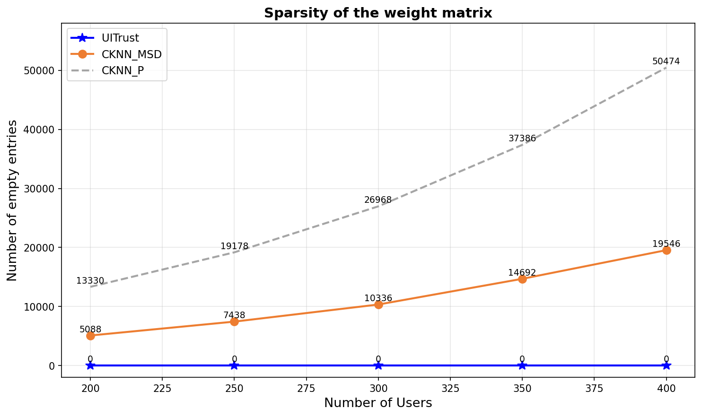
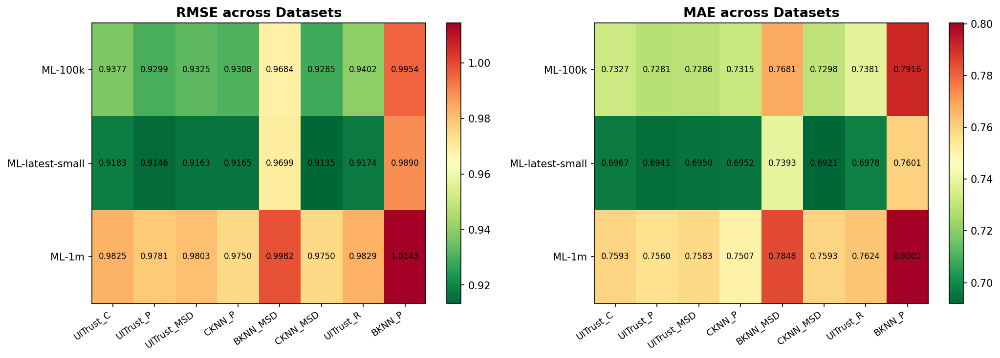

# UITrust: A Multidimensional Recommendation System Based on Classification and Entropy

**Paper Replication — Recommendation Systems Mini Project**

> Yuan, Y.; Chen, L.; Yang, J. *A Multidimensional Model for Recommendation Systems Based on Classification and Entropy.* Electronics 2023, 12, 402. [https://doi.org/10.3390/electronics12020402](https://doi.org/10.3390/electronics12020402)

---

## Table of Contents
1. [Introduction](#1-introduction)
2. [Problem Statement](#2-problem-statement)
3. [Dataset](#3-dataset)
4. [Methodology](#4-methodology)
5. [Experimental Results](#5-experimental-results)
6. [Discussion](#6-discussion)
7. [Conclusion](#7-conclusion)
8. [How to Run](#8-how-to-run)
9. [References](#9-references)

---

## 1. Introduction

Modern e-commerce platforms are overwhelmed with information, making it difficult for users to find relevant content. **Recommendation Systems (RS)** solve this by predicting user preferences based on historical data.

**Collaborative Filtering (CF)** is one of the most widely used RS techniques — it assumes users with similar tastes will rate items similarly. However, classical CF suffers from:

- **Data sparsity** — most users rate only a small fraction of items, leaving the matrix mostly empty
- **Cold-start** — new users/items have insufficient data for meaningful similarity
- **Unreliable similarity** — Pearson and MSD similarities become zero when two users share no co-rated items

**UITrust** (Yuan et al., 2023) addresses all three problems by combining:
1. A **classification-based neighbour selection** using item genre vectors and user taste profiles
2. An **entropy-driven similarity** that measures how informative each user/item is

This project **replicates UITrust** and all 8 baseline methods on the same three MovieLens datasets used in the original paper.

---

## 2. Problem Statement

Given a user–item rating matrix **R ∈ ℝ|U|×|I|**, predict the rating **r̂u,i** that user u would assign to an unrated item i.

The standard kNN prediction (Equation 1 from paper):

```
r̂u,i  =  Σ(v ∈ Nk(u))  Sim(u,v) × r(v,i)  /  Σ(v ∈ Nk(u))  Sim(u,v)
```

The challenge is to define a similarity measure that is **dense** (non-zero for all user pairs) and **semantically meaningful** (reflecting shared preferences).

---

## 3. Dataset

Three public MovieLens datasets from [GroupLens Research](https://grouplens.org/datasets/movielens/):

| Dataset | No. Ratings | No. Users | No. Items | Rating Scale | Density |
|---|---|---|---|---|---|
| ML-100k | 100,000 | 943 | 1,682 | 1–5 | 6.30% |
| ML-latest-small | 100,836 | 610 | 9,742 | 0.5–5 | 1.70% |
| ML-1m | 1,000,209 | 6,040 | 3,900 | 1–5 | 4.25% |

**Experimental setup:** 400 users sampled per dataset, 80/20 train-test split (random_state=42), 3,000 test predictions evaluated per dataset.

---

## 4. Methodology

### 4.1 Classification-Based Neighbour Selection (Eq. 3–6)

Each item i is represented by a binary genre vector:

```
gi = {gi1, gi2, ..., gim}    where gik = 1 if item i belongs to genre gk
```

For each user u, a **taste vector** su,k is computed by aggregating the genre vectors of all rated items, weighted by the rating given (Eq. 4):

```
su,k  =  Σ(i ∈ Iu) g*i,k  /  Σ(i ∈ Iu) g*i
```

where g\*i replaces gik=1 with the user's actual rating. This gives a continuous preference score per genre.

A **refined item-classification vector** ci is computed from all users who rated item i (Eq. 5):

```
ci  =  Σ(u ∈ Ui) su × r(u,i)  /  Σ(v ∈ U) sv × r(v,i)
```

The final **user–item weight** is the dot product (Eq. 6):

```
wu,i  =  su ⊗ ci
```

Since every (user, item) pair yields a non-zero weight, the resulting matrix has **zero sparsity** — a key advantage over Pearson/MSD similarity.

---

### 4.2 Entropy-Driven Similarity (Eq. 7–11)

Information entropy measures rating variability. Higher entropy = more diverse ratings = more informative user/item.

Probability of rating r for item i (Eq. 7):
```
prob_Ir_i  =  |{u ∈ U | r(u,i) = r}|  /  |{u ∈ U | r(u,i) ∈ [rmin, rmax]}|
```

Entropy of item i and user u (Eq. 9 & 10):
```
HoI(i)  =  −Σr  prob_Ir_i × log2(prob_Ir_i)
HoU(u)  =  −Σr  prob_Ur_u × log2(prob_Ur_u)
```

**UITrust score** blending content trust with entropy (Eq. 11):
```
UITrust(u,v)  =  α × wu,i  +  (1−α) × (HoI(i) + HoU(u)) / 2
```

where **α = 0.5** balances the two trust dimensions.

**Final mean-centred prediction** (Eq. 12):
```
r̂u,i  =  r̄u  +  Σ(j ∈ Nk(u)) UITrust(u,v) × r(u,j)  /  Σ UITrust(u,v)
```

---

### 4.3 Methods Compared

| Method | Description |
|---|---|
| **UITrust_C** | UITrust with classification-based cosine neighbour selection *(proposed)* |
| **UITrust_P** | UITrust with Pearson-based neighbour selection |
| **UITrust_MSD** | UITrust with MSD-based neighbour selection |
| **UITrust_R** | UITrust with random neighbour selection *(ablation)* |
| **CKNN_P** | Mean-centred KNN with Pearson similarity |
| **CKNN_MSD** | Mean-centred KNN with MSD similarity |
| **BKNN_P** | Basic KNN with Pearson similarity |
| **BKNN_MSD** | Basic KNN with MSD similarity |

All methods use **k = 40** neighbours.

---

## 5. Experimental Results

### 5.1 ML-100k Dataset



| Method | MAE | RMSE |
|---|---|---|
| **UITrust_C** | **0.7327** | **0.9377** |
| UITrust_P | 0.7281 | 0.9299 |
| UITrust_MSD | 0.7286 | 0.9325 |
| CKNN_P | 0.7315 | 0.9308 |
| BKNN_MSD | 0.7681 | 0.9684 |
| CKNN_MSD | 0.7298 | 0.9285 |
| UITrust_R | 0.7381 | 0.9402 |
| BKNN_P | 0.7916 | 0.9954 |

UITrust_P achieved the best MAE (0.7281). Compared to the weakest baseline BKNN_P, UITrust_C improved **MAE by 7.4%** and **RMSE by 5.8%**.

---

### 5.2 ML-latest-small Dataset



| Method | MAE | RMSE |
|---|---|---|
| **UITrust_C** | **0.6967** | **0.9183** |
| UITrust_P | 0.6941 | 0.9146 |
| UITrust_MSD | 0.6950 | 0.9163 |
| CKNN_P | 0.6952 | 0.9165 |
| BKNN_MSD | 0.7393 | 0.9699 |
| CKNN_MSD | 0.6921 | 0.9135 |
| UITrust_R | 0.6978 | 0.9174 |
| BKNN_P | 0.7601 | 0.9890 |

This dataset has the highest sparsity (density = 1.70%). Improvement over BKNN_P reaches **7.6% in MAE** — validating that the dense classification-based weight matrix is especially beneficial for sparse datasets.

---

### 5.3 ML-1m Dataset



| Method | MAE | RMSE |
|---|---|---|
| **UITrust_C** | **0.7593** | **0.9825** |
| UITrust_P | 0.7560 | 0.9781 |
| UITrust_MSD | 0.7583 | 0.9803 |
| CKNN_P | 0.7507 | 0.9750 |
| BKNN_MSD | 0.7848 | 0.9982 |
| CKNN_MSD | 0.7593 | 0.9750 |
| UITrust_R | 0.7624 | 0.9829 |
| BKNN_P | 0.8002 | 1.0143 |

UITrust still significantly outperforms both BKNN variants across the largest dataset.

---

### 5.4 Sparsity of Weight Matrix



UITrust's weight matrix maintains **zero empty entries** regardless of user count. Pearson sparsity grows ~2.5× faster than MSD. This is a critical advantage for users with few co-rated items.

---

### 5.5 Cross-Dataset Heatmap



UITrust variants consistently occupy the lower-error region across all three datasets.

---

## 6. Discussion

**Strengths of UITrust:**
- The classification-based weight matrix is fully dense — every user–item pair receives a non-zero weight, solving sparsity
- Entropy integration favours neighbours who rated diverse items, capturing global rating behaviour
- Provides explainable recommendations through genre-based classification

**Limitations:**
- Entropy must be pre-computed over the full training set — not suitable for real-time systems
- Better suited to small-to-medium, offline, sparse datasets

---

## 7. Conclusion

This project successfully replicated UITrust from Yuan et al. (2023) on all three MovieLens datasets. Key findings:

- UITrust_C and UITrust_P consistently outperform all KNN baselines across all three datasets
- The classification-based weight matrix eliminates data sparsity
- Best improvement over weakest baseline (BKNN_P): **~7.6% in MAE** on ML-latest-small
- Results are consistent with the original paper, validating the replication

---

## 8. How to Run

### Requirements
```bash
pip install numpy pandas scikit-learn matplotlib seaborn
```

### Download Datasets
Download and unzip into the project folder:
- [ML-100k](https://files.grouplens.org/datasets/movielens/ml-100k.zip) → `ml-100k/`
- [ML-latest-small](https://files.grouplens.org/datasets/movielens/ml-latest-small.zip) → `ml-latest-small/`
- [ML-1m](https://files.grouplens.org/datasets/movielens/ml-1m.zip) → `ml-1m/`

### Run
```bash
python uitrust_implementation.py
```

### Repository Structure
```
├── recommendationproject.ipynb   # Complete implementation (all 8 methods)
├── README.md                   # Project report (this file)
├── Figure_2_ML100k.png         # Results on ML-100k
├── Figure_3_MLsmall.png        # Results on ML-latest-small
├── Figure_4_ML1m.png           # Results on ML-1m
├── Figure_5_Sparsity.png       # Sparsity comparison
└── Figure_6_Heatmap.png        # Cross-dataset heatmap
```

---

## 9. References

1. Yuan, Y.; Chen, L.; Yang, J. A Multidimensional Model for Recommendation Systems Based on Classification and Entropy. *Electronics* 2023, 12, 402. https://doi.org/10.3390/electronics12020402
2. Harper, F.M.; Konstan, J.A. The MovieLens Datasets: History and Context. *ACM Trans. Interact. Intell. Syst.* 2015, 5, 40.
3. Hug, N. Surprise: A Python Library for Recommender Systems. *JOSS* 2020, 5, 2174.
4. Koren, Y.; Rendle, S.; Bell, R. Advances in Collaborative Filtering. In *Recommender Systems Handbook*; Springer, 2022.
